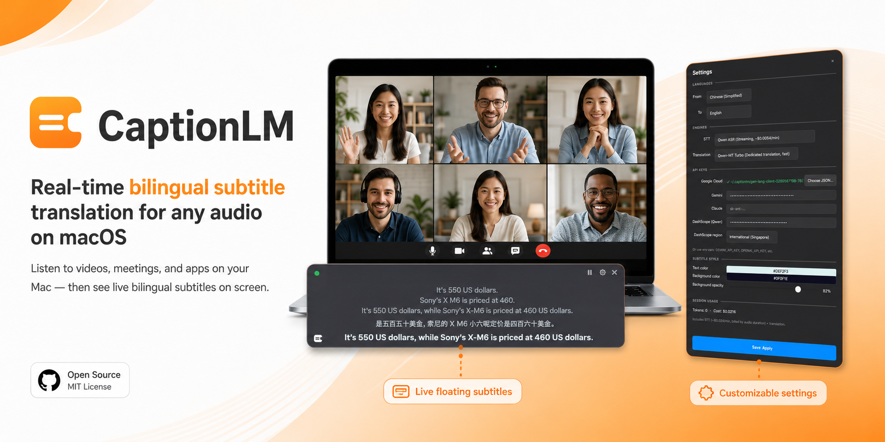
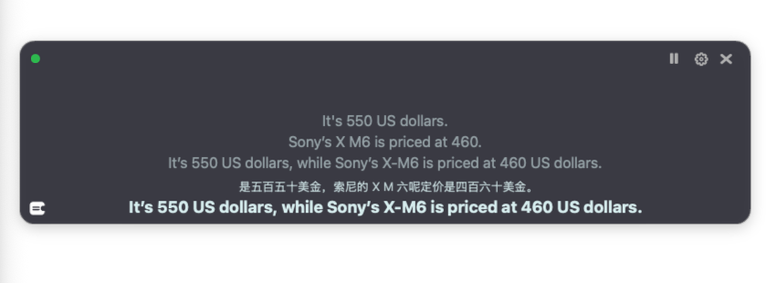
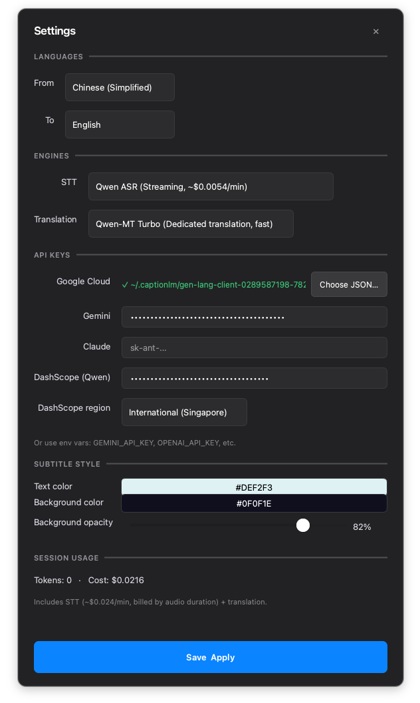
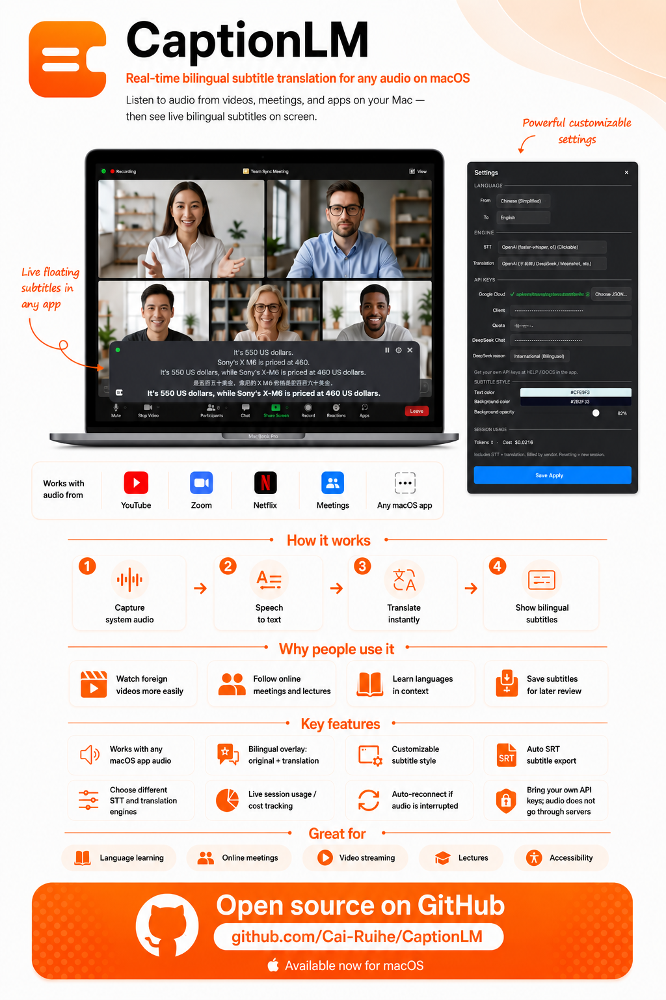

<div align="center">



# CaptionLM

**Real-time bilingual subtitle translation for any audio on macOS**

[](LICENSE)
[](https://www.python.org/downloads/)
[](https://www.apple.com/macos/)
[](https://github.com/Cai-Ruihe/CaptionLM/pulls)

[简体中文](README_zh.md) · [Installation](docs/INSTALL.md) · [API Setup](docs/API_SETUP.md) · [Design](docs/DESIGN.md)

</div>

---

CaptionLM captures system audio from **any** macOS application — YouTube, Zoom, Netflix, conference calls — transcribes it in real time, and overlays bilingual subtitles on screen. Choose your speech-to-text engine and translation provider independently to balance latency, cost, and quality.

## ✨ Features

- 🎙️ **Captures any app's audio** — uses ScreenCaptureKit, no virtual audio devices needed
- 🌐 **Multi-engine** — mix and match STT (Google Cloud / Qwen ASR / Qwen LiveTranslate / Apple SpeechAnalyzer / Whisper) with translators (Gemini / Qwen-MT / Claude / Google Free)
- 💬 **Bilingual overlay** — original + translation, always-on-top, draggable, customizable opacity
- 📺 **Auto SRT export** — every session is saved as a bilingual `.srt` to `~/Documents/CaptionLM/sessions/`
- 🪙 **Live cost meter** — see per-session token usage and USD cost while it's running
- 🔄 **Auto-reconnect** — when macOS interrupts the audio stream, CaptionLM retries automatically
- 🇨🇳 **Singapore (international) and China-mainland endpoints** — works on both sides of the firewall for Qwen / DashScope

## 🎬 Demo

<div align="center">



*Bilingual overlay running on a live YouTube video — original Japanese above, Chinese translation below*

<br/>



*Settings panel — pick your STT engine + translator independently, plug in your API keys*

</div>

## 🚀 Quick start

### Option 1 — Pre-built .dmg (recommended for end users)

1. Download the latest `.dmg` from [Releases](https://github.com/Cai-Ruihe/CaptionLM/releases)
2. Drag `CaptionLM.app` into `/Applications`
3. **Run this once in Terminal** to clear macOS Gatekeeper's quarantine flag:
   ```bash
   xattr -cr /Applications/CaptionLM.app
   ```
   *(Required because CaptionLM isn't yet Apple-Developer-ID-signed — see [First-launch notes](#%EF%B8%8F-first-launch-notes-pre-10))*
4. Open it — grant **Screen Recording** permission when prompted (System Settings → Privacy & Security → Screen Recording → enable CaptionLM)
5. Click the menubar icon → **Settings** → enter your API keys (see [API Setup](docs/API_SETUP.md))
6. Click **Start** and play any audio in any app

### Option 2 — From source (for developers)

```bash
git clone https://github.com/Cai-Ruihe/CaptionLM.git
cd CaptionLM
python3.11 -m venv .venv
source .venv/bin/activate
pip install -e ".[all]"
captionlm
```

See [docs/INSTALL.md](docs/INSTALL.md) for detailed instructions including Python setup and troubleshooting.

## ⚠️ First-launch notes (pre-1.0)

CaptionLM is currently shipped with an **ad-hoc code signature** (not an Apple Developer ID + notarized signature, which costs $99/year). This means **macOS Gatekeeper and TCC will treat each fresh download / each update as an unknown app**. Two small workarounds are needed until proper signing is in place. **None of this affects functionality** — it's purely macOS's "trust this app?" handshake.

### 1. "CaptionLM is damaged and can't be opened" on first launch

This message is misleading — the `.app` is **not damaged**. macOS attaches a `com.apple.quarantine` extended attribute to anything downloaded via a browser, and Gatekeeper refuses to launch ad-hoc-signed apps that carry this attribute. One terminal command clears it:

```bash
xattr -cr /Applications/CaptionLM.app
```

Then double-click the app normally. **You only need to do this once per download.**

### 2. "Allow screen recording" prompt after updating to a new version

After replacing `/Applications/CaptionLM.app` with a newer `.dmg`, macOS may pop up the screen-recording permission dialog **again** (even though you already granted it for the previous version). This is because each new build has a different ad-hoc signature, and TCC (Apple's permissions database) treats it as a different app.

**Fix:**

1. **System Settings → Privacy & Security → Screen & System Audio Recording**
2. Find **CaptionLM** in the list — toggle it **off**, then back **on** (or click the `−` minus button to remove the stale entry, then `+` to add the new `.app`)
3. **Quit CaptionLM and re-open it** — the new permission grant takes effect on next launch
4. Same flow may apply to **Microphone** permission if you've enabled mic fallback

### Why these workarounds exist

These two friction points come from the same root cause: **CaptionLM doesn't yet have an Apple Developer ID + notarization** ($99/year + Apple's automated malware scan). With proper signing:

- ❌ "Damaged" warning would never appear — Gatekeeper would trust the signature
- ❌ TCC wouldn't reset between updates — the signature identity stays the same

Apple Developer ID signing + notarization is on the [roadmap](#-roadmap). Until then, the two commands above are the entire workaround.

## 🔑 API setup

CaptionLM is free software, but most STT and translation engines require an API key. **You bring your own key** — nothing routes through our servers. The most common combo is:

| Component | Recommended | Cost (estimate) |
|---|---|---|
| **STT** | Google Cloud Speech-to-Text streaming | ~$0.024/min, **60 free min/month** |
| **Translation** | Gemini 2.5 Flash | ~$0.01/hr of speech |
| **Alternative all-Qwen** | Qwen LiveTranslate (ASR+translation in one) | ~$0.005/min, ~¥0.36/hr |

Step-by-step instructions for each provider — including screenshots of the Google Cloud Console and Alibaba Model Studio — are in **[docs/API_SETUP.md](docs/API_SETUP.md)**.

## 🔄 Updating

macOS `.app` bundles are self-contained — no installer, no uninstaller. To update:

1. Quit the running CaptionLM (menubar icon → Quit, or click the ✕)
2. Download the new `.dmg`
3. Drag the new `CaptionLM.app` into `/Applications` — Finder will ask "replace?" → **Replace**
4. Run `xattr -cr /Applications/CaptionLM.app` to clear Gatekeeper quarantine (one-time, see [First-launch notes](#%EF%B8%8F-first-launch-notes-pre-10))
5. Re-grant Screen Recording permission — see [First-launch notes #2](#2-allow-screen-recording-prompt-after-updating-to-a-new-version)
6. Re-open CaptionLM

> The grant step is needed only until we ship a properly Apple-signed build. Steps 4-5 will go away once Developer ID signing is in place.

Your settings and data are kept across updates (they live outside the `.app`):

| Data | Location |
|---|---|
| API keys, UI preferences | `~/Library/Application Support/CaptionLM/settings.toml` |
| Google Cloud credentials | `~/.captionlm/*.json` |
| Bilingual SRT exports | `~/Documents/CaptionLM/sessions/*.srt` |

To uninstall: drag `CaptionLM.app` to Trash. For a clean wipe also `rm -rf ~/Library/Application\ Support/CaptionLM ~/.captionlm ~/.cache/captionlm`.

## 🎯 How it works

<div align="center">



</div>

CaptionLM intercepts the audio stream from any macOS application using ScreenCaptureKit (no virtual audio device needed), pipes it through your chosen speech-to-text engine, sends the recognized text to your chosen translator, and overlays both languages on screen as a draggable always-on-top panel. Each component is independent so you can mix-and-match providers by latency, cost, and quality.

## 🏗️ Architecture (technical detail)

<details>
<summary>Click to expand the full data flow</summary>

```
┌────────────────────────────────────────────────────────────────┐
│  macOS app (YouTube / Zoom / anything)                         │
└──────────────────────┬─────────────────────────────────────────┘
                       │ system audio
                       ▼
            ┌──────────────────────┐
            │  capture_audio.swift │  ← ScreenCaptureKit, no kext
            │  (PCM @ 16kHz mono)  │
            └──────────┬───────────┘
                       │ stdout: float32 PCM
                       ▼
        ┌────────────────────────────────────┐
        │  STT engine (pluggable)            │
        │  • Google Cloud Speech streaming   │
        │  • Qwen ASR (WebSocket realtime)   │
        │  • Qwen LiveTranslate (E2E)        │  ← skips translator
        │  • Apple SpeechAnalyzer            │
        │  • Faster-Whisper (local)          │
        └──────────┬─────────────────────────┘
                   │ (text, is_final)
                   ▼
        ┌────────────────────────────────────┐
        │  Translator (pluggable)            │
        │  • Gemini 2.5 Flash (streaming)    │
        │  • Qwen-MT Turbo (streaming)       │
        │  • Anthropic Claude                │
        │  • Google Translate (free)         │
        └──────────┬─────────────────────────┘
                   │ (orig, translated)
                   ▼
        ┌────────────────────────────────────┐
        │  Overlay (PyObjC NSPanel)          │  ← always-on-top
        │  • Live area (current utterance)   │
        │  • Scrollable history (last 50)    │
        └────────────────────────────────────┘
```

See [docs/DESIGN.md](docs/DESIGN.md) for the full architecture write-up including utterance buffering, partial-revision handling, and auto-reconnect logic.

</details>

## 🛣️ Roadmap

- [ ] **Apple Developer ID signing + notarization** — eliminates the "damaged" Gatekeeper warning and TCC permission resets on update (see [First-launch notes](#%EF%B8%8F-first-launch-notes-pre-10))
- [ ] Windows support (WASAPI loopback in place of ScreenCaptureKit)
- [ ] Live retranslation polish across more providers
- [ ] One-click `.dmg` build via GitHub Actions
- [ ] Localization for the Settings panel (currently English-only)

## 🤝 Contributing

PRs welcome! See [CONTRIBUTING.md](CONTRIBUTING.md) for the development workflow. Areas of high interest:

- Windows port (ScreenCaptureKit alternatives)
- Additional STT/translator providers
- UI polish + accessibility

## 📜 License

MIT — see [LICENSE](LICENSE).

---

<div align="center">
<sub>Built with PySide6, PyObjC, and a lot of testing on Japanese-to-Chinese subtitle workflows.</sub>
</div>
